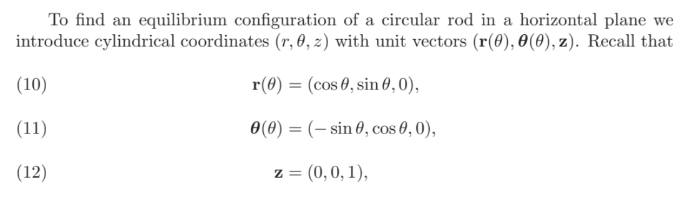
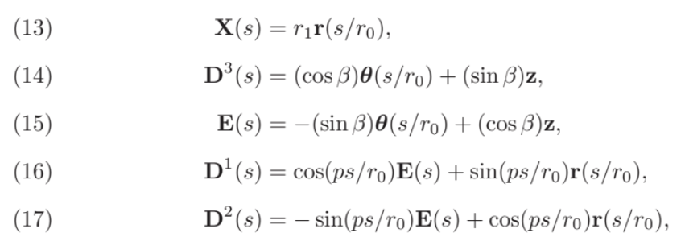
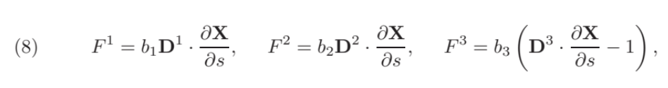
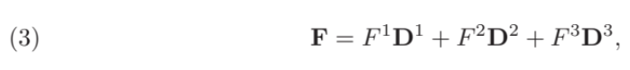
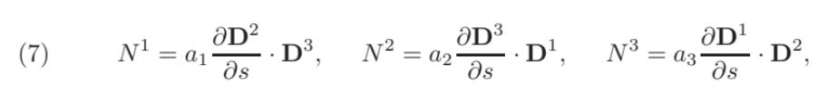
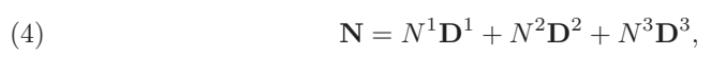
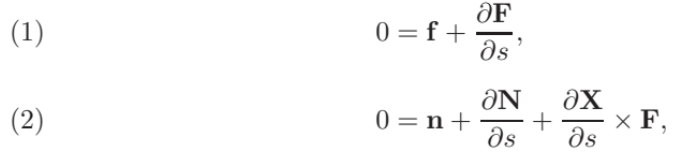
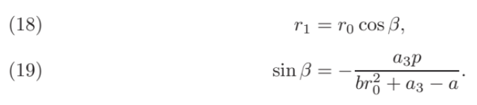
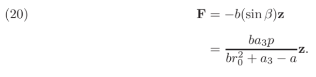

# Force Calculations

We walk through the computation for explicit expressions of force from the flagella to the fluid using equations from *Dynamics of an Open Elastic Rod with Intrinsic Curvature and Twist in a Viscous Fluid* — S. Lim (2010).

## 1. Triad for a Circle with Equilibrium Conditions



We begin with the standard cylindrical polar basis in the (xy)-plane:

```mathematica
rVec[\[Theta]_] = {Cos[\[Theta]], Sin[\[Theta]], 0}
\[Theta]Vec[\[Theta]_] = {-Sin[\[Theta]], Cos[\[Theta]], 0}
zVec = {0, 0, 1}
```

Here, the curve **X**(s) is proportional to a circle in the (xy)-plane.

---



```mathematica
x[s_] = r1*rVec[s/r0]

d3[s_] = (Cos[\[Beta]]*\[Theta]Vec[s/r0]) + (Sin[\[Beta]]*zVec)
e[s_] = -(Sin[\[Beta]]*\[Theta]Vec[s/r0]) + (Cos[\[Beta]]*zVec)

d1[s_] = Cos[p*s/r0]*e[s] + Sin[p*s/r0]*rVec[s/r0]
d2[s_] = -Sin[p*s/r0]*e[s] + Cos[p*s/r0]*rVec[s/r0]
```

---

Now, we find the components of the forces from the rod. Note: the paper assumes b1=b2=b3, so I set these material parameters equal to b.



```mathematica
limForce1[s_] = b*(d1[s] . D[x[s], s])
limForce2[s_] = b*(d2[s] . D[x[s], s])
limForce3[s_] = b*(d3[s] . D[x[s], s] - 1)
```

We take a linear combination of the force components to find the total force.



```mathematica
limtotalForce[s_] = 
 FullSimplify[
  limForce1[s]*d1[s] + 
  limForce2[s]*d2[s] + 
  limForce3[s]*d3[s]
 ]
```

---

We do a similar computation for torque. The paper assumes (a_1 = a_2), so these parameters are set equal to (a).



```mathematica
limTorque1[s_] = a*(D[d2[s], s] . d3[s])
limTorque2[s_] = a*(D[d3[s], s] . d1[s])
limTorque3[s_] = a3*(D[d1[s], s] . d2[s])
```

We take a linear combination of the torque components to find the total torque.



```mathematica
limtotalTorque[s_] = 
 FullSimplify[
  limTorque1[s]*d1[s] + 
  limTorque2[s]*d2[s] + 
  limTorque3[s]*d3[s]
 ]
```

---

Now, we have built the necessary pieces to solve the equilibrium equations (1) and (2). Note: at equilibrium,

[
\mathbf{f} = 0, \qquad \mathbf{n} = 0.
]



```mathematica
partialF = 
 FullSimplify[
  D[limtotalForce[s], s]
 ]

partialN = 
 FullSimplify[
  D[limtotalTorque[s], s]
 ]

partialXcrossF = 
 FullSimplify[
  Cross[D[x[s], s], limtotalForce[s]]
 ]

secondEqn = 
 FullSimplify[
  partialN + partialXcrossF
 ]
```

First equilibrium condition:

```mathematica
firstEquilibriumCondition = 
 FullSimplify[
  Solve[partialF[[1]] == 0, r1]
 ]
```

Second equilibrium condition (using (r_1 = r_0 \cos(\beta))):

```mathematica
secondEquilibriumCondition = 
 FullSimplify[
  Solve[secondEqn[[1]] == 0, Sin[\[Beta]]]
 ] /. r1 -> r0*Cos[\[Beta]]
```

---



```mathematica
r1Value = r1 /. firstEquilibriumCondition[[1]]

sinBetaValue = Sin[\[Beta]] /. secondEquilibriumCondition[[1]]
```

---

Finally, we obtain the explicit solution for total force by plugging in r1.



```mathematica
limtotalForce[s] /. r1 -> r1Value
```

## 2. Triad for a Helix of radius r0 and constant pitch c with Equilibrium Conditions


We begin with the standard cylindrical polar basis in the (xy)-plane:

```mathematica
rVec[\[Theta]_] = {Cos[\[Theta]], Sin[\[Theta]], 0}
\[Theta]Vec[\[Theta]_] = {-Sin[\[Theta]], Cos[\[Theta]], 0}
zVec = {0, 0, 1}
```

Now, the curve **X**(s) is proportional to a helix of radius r0 and constant pitch c.

---


```mathematica

c = 1;
helix[\[Theta]_] = {Cos[\[Theta]], Sin[\[Theta]], c*\[Theta]}

x[s_] = r1*helix[s/r0]
d3[s_] = (Cos[\[Beta]]*\[Theta]Vec[s/r0]) + (Sin[\[Beta]]*zVec)
e[s_] = -(Sin[\[Beta]]*\[Theta]Vec[s/r0]) + (Cos[\[Beta]]*zVec)
d1[s_] = Cos[p*s/r0]*e[s] + Sin[p*s/r0]*rVec[s/r0]
d2[s_] = -Sin[p*s/r0]*e[s] + Cos[p*s/r0]*rVec[s/r0]

```

---

Now, we find the components of the forces from the rod. Note: the paper assumes b1=b2=b3, so I set these material parameters equal to b.


```mathematica
limForce1[s_] = b*(d1[s] . D[x[s], s])
limForce2[s_] = b*(d2[s] . D[x[s], s])
limForce3[s_] = b*(d3[s] . D[x[s], s] - 1)
```

We take a linear combination of the force components to find the total force.


```mathematica
limtotalForce[s_] = 
 FullSimplify[
  limForce1[s]*d1[s] + 
  limForce2[s]*d2[s] + 
  limForce3[s]*d3[s]
 ]
```

---

We do a similar computation for torque. The paper assumes (a_1 = a_2), so these parameters are set equal to (a).


```mathematica
limTorque1[s_] = a*(D[d2[s], s] . d3[s])
limTorque2[s_] = a*(D[d3[s], s] . d1[s])
limTorque3[s_] = a3*(D[d1[s], s] . d2[s])
```

We take a linear combination of the torque components to find the total torque.


```mathematica
limtotalTorque[s_] = 
 FullSimplify[
  limTorque1[s]*d1[s] + 
  limTorque2[s]*d2[s] + 
  limTorque3[s]*d3[s]
 ]
```

---

Now, we have built the necessary pieces to solve the equilibrium equations (1) and (2). Note: at equilibrium,

[
\mathbf{f} = 0, \qquad \mathbf{n} = 0.
]


```mathematica
partialF = 
 FullSimplify[
  D[limtotalForce[s], s]
 ]

partialN = 
 FullSimplify[
  D[limtotalTorque[s], s]
 ]

partialXcrossF = 
 FullSimplify[
  Cross[D[x[s], s], limtotalForce[s]]
 ]

secondEqn = 
 FullSimplify[
  partialN + partialXcrossF
 ]
```

First equilibrium condition:

```mathematica
firstEquilibriumCondition = 
 FullSimplify[
  Solve[partialF[[1]] == 0, r1]
 ]
```

Second equilibrium condition (using (r_1 = r_0 \cos(\beta))):

```mathematica
secondEquilibriumCondition = 
 FullSimplify[
  Solve[secondEqn[[1]] == 0, Sin[\[Beta]]]
 ] /. r1 -> r0*Cos[\[Beta]]
```

---


```mathematica
r1Value = r1 /. firstEquilibriumCondition[[1]]

sinBetaValue = Sin[\[Beta]] /. secondEquilibriumCondition[[1]]
```

---

Finally, we obtain the explicit solution for total force by plugging in r1.


```mathematica
limtotalForce[s] /. r1 -> r1Value
```

## 3. Triad for a Parabolic Helix of radius r0 and constant pitch c with Equilibrium Conditions


We begin with the standard cylindrical polar basis in the (xy)-plane:

```mathematica
rVec[\[Theta]_] = {Cos[\[Theta]], Sin[\[Theta]], 0}
\[Theta]Vec[\[Theta]_] = {-Sin[\[Theta]], Cos[\[Theta]], 0}
zVec = {0, 0, 1}
```

Now, the curve **X**(s) is proportional to a parabolic helix of radius r0 and constant pitch c.

---


```mathematica
c = 1;
helix[\[Theta]_] = {Cos[\[Theta]], Sin[\[Theta]], c*\[Theta]^2}

x[s_] = r1*helix[s/r0]
d3[s_] = (Cos[\[Beta]]*\[Theta]Vec[s/r0]) + (Sin[\[Beta]]*zVec)
e[s_] = -(Sin[\[Beta]]*\[Theta]Vec[s/r0]) + (Cos[\[Beta]]*zVec)
d1[s_] = Cos[p*s/r0]*e[s] + Sin[p*s/r0]*rVec[s/r0]
d2[s_] = -Sin[p*s/r0]*e[s] + Cos[p*s/r0]*rVec[s/r0]
```

---

Now, we find the components of the forces from the rod. Note: the paper assumes b1=b2=b3, so I set these material parameters equal to b.


```mathematica
limForce1[s_] = b*(d1[s] . D[x[s], s])
limForce2[s_] = b*(d2[s] . D[x[s], s])
limForce3[s_] = b*(d3[s] . D[x[s], s] - 1)
```

We take a linear combination of the force components to find the total force.


```mathematica
limtotalForce[s_] = 
 FullSimplify[
  limForce1[s]*d1[s] + 
  limForce2[s]*d2[s] + 
  limForce3[s]*d3[s]
 ]
```

---

We do a similar computation for torque. The paper assumes (a_1 = a_2), so these parameters are set equal to (a).


```mathematica
limTorque1[s_] = a*(D[d2[s], s] . d3[s])
limTorque2[s_] = a*(D[d3[s], s] . d1[s])
limTorque3[s_] = a3*(D[d1[s], s] . d2[s])
```

We take a linear combination of the torque components to find the total torque.


```mathematica
limtotalTorque[s_] = 
 FullSimplify[
  limTorque1[s]*d1[s] + 
  limTorque2[s]*d2[s] + 
  limTorque3[s]*d3[s]
 ]
```

---

Now, we have built the necessary pieces to solve the equilibrium equations (1) and (2). Note: at equilibrium,

[
\mathbf{f} = 0, \qquad \mathbf{n} = 0.
]


```mathematica
partialF = 
 FullSimplify[
  D[limtotalForce[s], s]
 ]

partialN = 
 FullSimplify[
  D[limtotalTorque[s], s]
 ]

partialXcrossF = 
 FullSimplify[
  Cross[D[x[s], s], limtotalForce[s]]
 ]

secondEqn = 
 FullSimplify[
  partialN + partialXcrossF
 ]
```

First equilibrium condition:

```mathematica
firstEquilibriumCondition = 
 FullSimplify[
  Solve[partialF[[1]] == 0, r1]
 ]
```

Second equilibrium condition (using (r_1 = r_0 \cos(\beta))):

```mathematica
secondEquilibriumCondition = 
 FullSimplify[
  Solve[secondEqn[[1]] == 0, Sin[\[Beta]]]
 ] /. r1 -> r0*Cos[\[Beta]]
```

---


```mathematica
r1Value = r1 /. firstEquilibriumCondition[[1]]

sinBetaValue = Sin[\[Beta]] /. secondEquilibriumCondition[[1]]
```

---

Finally, we obtain the explicit solution for total force by plugging in r1.


```mathematica
limtotalForce[s] /. r1 -> r1Value
```

## 4. Triad for a Helix of Variable Radius and constant pitch c with Equilibrium Conditions


We begin with the standard cylindrical polar basis in the (xy)-plane:

```mathematica
rVec[\[Theta]_] = {Cos[\[Theta]], Sin[\[Theta]], 0}
\[Theta]Vec[\[Theta]_] = {-Sin[\[Theta]], Cos[\[Theta]], 0}
zVec = {0, 0, 1}
```

Now, the curve **X**(s) is proportional to a helix of variable radius and constant pitch c.

---


```mathematica
c = 1;
helix[\[Theta]_] = {Cos[\[Theta]]*E^(-s/40), Sin[\[Theta]]*E^(-s/40), 
  c*\[Theta]}

x[s_] = r1*helix[s/r0];
d3[s_] = (Cos[\[Beta]]*\[Theta]Vec[s/r0]) + (Sin[\[Beta]]*zVec);
e[s_] = -(Sin[\[Beta]]*\[Theta]Vec[s/r0]) + (Cos[\[Beta]]*zVec);
d1[s_] = Cos[p*s/r0]*e[s] + Sin[p*s/r0]*rVec[s/r0];
d2[s_] = -Sin[p*s/r0]*e[s] + Cos[p*s/r0]*rVec[s/r0];
```

---

Now, we find the components of the forces from the rod. Note: the paper assumes b1=b2=b3, so I set these material parameters equal to b.


```mathematica
limForce1[s_] = b*(d1[s] . D[x[s], s])
limForce2[s_] = b*(d2[s] . D[x[s], s])
limForce3[s_] = b*(d3[s] . D[x[s], s] - 1)
```

We take a linear combination of the force components to find the total force.


```mathematica
limtotalForce[s_] = 
 FullSimplify[
  limForce1[s]*d1[s] + 
  limForce2[s]*d2[s] + 
  limForce3[s]*d3[s]
 ]
```

---

We do a similar computation for torque. The paper assumes (a_1 = a_2), so these parameters are set equal to (a).


```mathematica
limTorque1[s_] = a*(D[d2[s], s] . d3[s])
limTorque2[s_] = a*(D[d3[s], s] . d1[s])
limTorque3[s_] = a3*(D[d1[s], s] . d2[s])
```

We take a linear combination of the torque components to find the total torque.


```mathematica
limtotalTorque[s_] = 
 FullSimplify[
  limTorque1[s]*d1[s] + 
  limTorque2[s]*d2[s] + 
  limTorque3[s]*d3[s]
 ]
```

---

Now, we have built the necessary pieces to solve the equilibrium equations (1) and (2). Note: at equilibrium,

[
\mathbf{f} = 0, \qquad \mathbf{n} = 0.
]


```mathematica
partialF = 
 FullSimplify[
  D[limtotalForce[s], s]
 ]

partialN = 
 FullSimplify[
  D[limtotalTorque[s], s]
 ]

partialXcrossF = 
 FullSimplify[
  Cross[D[x[s], s], limtotalForce[s]]
 ]

secondEqn = 
 FullSimplify[
  partialN + partialXcrossF
 ]
```

First equilibrium condition:

```mathematica
firstEquilibriumCondition = 
 FullSimplify[
  Solve[partialF[[1]] == 0, r1]
 ]
```

Second equilibrium condition (using (r_1 = r_0 \cos(\beta))):

```mathematica
secondEquilibriumCondition = 
 FullSimplify[
  Solve[secondEqn[[1]] == 0, Sin[\[Beta]]]
 ] /. r1 -> r0*Cos[\[Beta]]
```

---


```mathematica
r1Value = r1 /. firstEquilibriumCondition[[1]]

sinBetaValue = Sin[\[Beta]] /. secondEquilibriumCondition[[1]]
```

---

Finally, we obtain the explicit solution for total force by plugging in r1.


```mathematica
limtotalForce[s] /. r1 -> r1Value
```